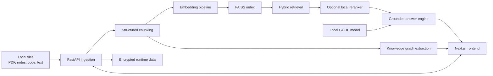

<div align="center">

<h1>LocalMind OS</h1>

<p><strong>A local-first AI workspace for private document ingestion, semantic search, grounded chat, knowledge graphs, and offline model control.</strong></p>

<p>
  
  
  
  
  
</p>

<p>
  <a href="#quick-start">Quick Start</a> |
  <a href="#feature-overview">Feature Overview</a> |
  <a href="#architecture">Architecture</a> |
  <a href="#local-model-setup">Local Model Setup</a> |
  <a href="#quality-checks">Quality Checks</a>
</p>

</div>

---

## Overview

LocalMind OS is built for people who want RAG-style workflows without sending their knowledge base to a hosted service. It combines a Next.js frontend with a FastAPI backend, local document processing, semantic retrieval, optional reranking, local GGUF inference, encrypted runtime storage, and UI controls for managing the active offline model stack.

The result is a workspace where you can upload files, search across chunks, ask grounded questions, inspect evidence, explore relationships, switch local models, and evaluate retrieval quality from one interface.

## Why LocalMind OS

| Private by default | Grounded by design | Model-aware operations | Study and evaluation ready |
| --- | --- | --- | --- |
| Documents, vectors, and runtime artifacts stay local on your machine. | Answers are built from retrieved evidence and can refuse weak support in trust mode. | Switch local LLM, embedding, and reranker settings, then validate and reindex from the UI. | Generate study outputs and measure retrieval quality with built-in evaluation views. |

## Feature Overview

| Area | What it covers |
| --- | --- |
| Ingestion | PDFs, notes, code, and structured text files can be added to a local knowledge base. |
| Chunking | Structured chunking uses heading-aware overlap to preserve context. |
| Retrieval | Dense vector search is combined with lexical scoring, with optional local reranking. |
| Chat | Grounded answers include citations, evidence panels, scoped file selection, and trust-mode refusal behavior. |
| Output modes | Standard answers, study guides, flashcards, and quizzes. |
| Knowledge graph | Explore relationships extracted from the indexed material. |
| Model management | Detect, switch, validate, and reindex local LLM, embedding, and reranker stacks. |
| Evaluation | View retrieval Top-1, Top-3, Top-5, MRR, and active local stack details. |
| Security | Passphrase-based protection for persisted runtime data using local encryption. |

## Workspace Experience

| Page | Purpose |
| --- | --- |
| `/` | Dashboard with stats, insights, active capability status, and recent activity. |
| `/upload` | Add files to the workspace and trigger ingestion. |
| `/search` | Run semantic search and inspect retrieved chunks. |
| `/chat` | Ask grounded questions over your indexed data. |
| `/graph` | Explore entity and topic relationships. |
| `/models` | Manage local LLM, embedding, and reranker selections. |
| `/evaluate` | Review retrieval benchmarks and stack readiness. |

## Architecture



## Stack

| Layer | Tools |
| --- | --- |
| Frontend | Next.js 14, React 18, TypeScript, Tailwind CSS |
| Backend | FastAPI, Uvicorn, Pydantic, NumPy |
| Retrieval | SentenceTransformers, FAISS, lexical scoring, optional local cross-encoder reranker |
| Local inference | `llama-cpp-python` with GGUF models |
| Extraction | PyMuPDF / PyPDF2 |
| Security | scrypt key derivation and AES-GCM encryption |

## Quick Start

### Recommended environment

- Windows PowerShell commands are shown below.
- Python `3.12` or `3.13` is recommended for the fullest local AI and graph workflow.
- Python `3.14` still runs, but spaCy-based graph extraction is reduced automatically.
- Node.js `18+` is recommended for the frontend.

### 1. Start the backend

```powershell
cd backend
python -m venv .venv
.\.venv\Scripts\activate
pip install -r requirements.txt

# Recommended for the full offline AI stack
pip install -r requirements-ai.txt
python -m spacy download en_core_web_sm

uvicorn main:app --reload --host 127.0.0.1 --port 8000
```

Backend API docs:

- [http://127.0.0.1:8000/docs](http://127.0.0.1:8000/docs)

### 2. Start the frontend

```powershell
cd frontend
npm install
npm run dev
```

Frontend:

- [http://localhost:3000](http://localhost:3000)

### 3. First-run flow

1. Open the frontend and create a passphrase.
2. Unlock the backend with that same passphrase on future launches.
3. Upload your own files, or use the sample content in `backend/demo_data/`.
4. Search, chat, inspect the graph, manage models, and run evaluation checks.

## Local Model Setup

The repository does not commit model binaries. Keep everything local under `backend/models/`.

<details>
<summary><strong>Expected model layout</strong></summary>

```text
backend/models/
|- *.gguf
|- embeddings/
|  `- <embedding-model-folder>/
`- rerankers/
   `- <reranker-model-folder>/
```

</details>

### Recommended laptop profile

- Around `8 GB` RAM, CPU-only: prefer `1.5B` to `3B` instruct models.
- Quantization such as `Q4_K_M` is the practical target for smaller local machines.
- `7B` class models usually need more RAM and will feel slow or unstable on lightweight setups.

### Useful environment variables

- `LOCALMIND_LLM_PROVIDER`
- `LOCALMIND_LLM_MODEL`
- `LOCALMIND_LLM_CONTEXT_SIZE`
- `LOCALMIND_EMBEDDING_MODEL`
- `LOCALMIND_RERANKER_MODEL`

### Runtime behavior

- The backend defaults to local-only inference.
- No third-party API key is required for normal operation.
- If a full local model is unavailable, the system falls back gracefully where possible.

## Security and Data

### Passphrase flow

- On first run, create a passphrase in the UI.
- Persisted runtime artifacts under `backend/data` are protected locally after setup.
- If the passphrase is lost, the encrypted runtime data cannot be recovered through the application.

### Persisted artifacts

Runtime data may include:

- `chunks.jsonl`
- `faiss.index`
- `index_map.json`
- `meta.json`
- `graph.json`
- `query_log.jsonl`

## API Surface

<details>
<summary><strong>Key backend routes</strong></summary>

| Area | Routes |
| --- | --- |
| Security | `/security/status`, `/security/setup`, `/security/unlock`, `/security/lock` |
| Ingestion | `/ingest`, `/ingest_demo`, `/reindex` |
| Retrieval and chat | `/search`, `/ask`, `/graph` |
| Workspace state | `/status`, `/stats`, `/insights`, `/catalog` |
| Conversations | `/conversations`, `/conversations/{session_id}` |
| Model operations | `/models`, `/models/apply`, `/models/validate` |
| Evaluation | `/evaluate` |

</details>

## Repository Layout

```text
.
|- backend/
|  |- main.py
|  |- services/
|  |- tests/
|  |- demo_data/
|  |- data/            # runtime-generated, ignored from git
|  `- models/          # local models, ignored from git
|- frontend/
|  |- src/
|  `- package.json
`- README.md
```

## Quality Checks

### Backend tests

```powershell
cd backend
.\.venv\Scripts\python.exe -m unittest discover -s tests -v
```

### Frontend production build

```powershell
cd frontend
npm run build
```

## Operational Notes

- Embeddings try local SentenceTransformers first, then fall back to hashed TF-IDF.
- Vector search prefers FAISS and falls back to NumPy similarity if FAISS is unavailable.
- Reranking can use a local cross-encoder when a reranker model exists, otherwise retrieval stays lexical-only.
- LLM mode prefers local GGUF inference and falls back to extractive answer generation when needed.
- The repository ignores virtual environments, `node_modules`, build output, local runtime data, and local model binaries.

## Local Documentation

- Backend details: [backend/README.md](backend/README.md)
- Frontend details: [frontend/README.md](frontend/README.md)
- Model folder notes: [backend/models/README.md](backend/models/README.md)
